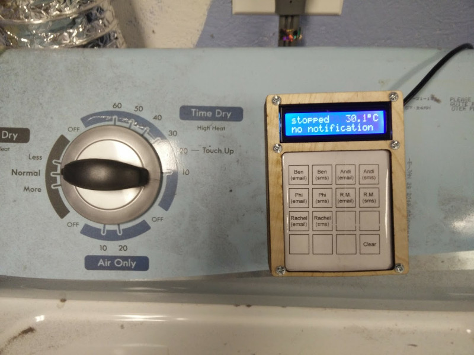

Dryer Sensor
============

This is a simple ESP8266-based sensor to detect when a clothes dryer has
stopped and send a message to an MQTT server.  The MQTT server can then
send a notification as appropriate (e.g. SMS, email, etc.)

The sensor is built from the following:

* Wemos D1 Mini ESP8266
* HD44780 2-line LCD character display
* MPU6050 accelerometer
* 4x4 matrix keypad, exposed via I2C

