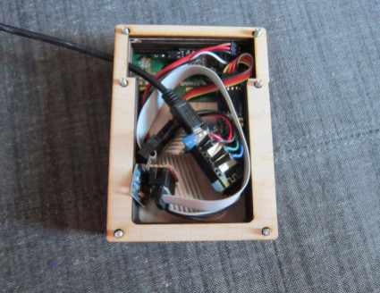

Dryer Sensor
============

This is a simple ESP8266-based sensor to detect when a clothes dryer has
stopped and send a message to an MQTT server.  The MQTT server can then
send a notification as appropriate (e.g. SMS, email, etc.)

(Note that the MQTT server is not part of this project but is separate.
This project does not directly notify anyone, merely inform the MQTT server
when the dryer changes state and what the new state is, or when the
keypad is used to change the person and method to notify.)

The sensor is built from the following:

* Wemos D1 Mini ESP8266
* HD44780 2-line LCD character display
* MPU6050 accelerometer
* 4x4 matrix keypad, exposed via I2C

